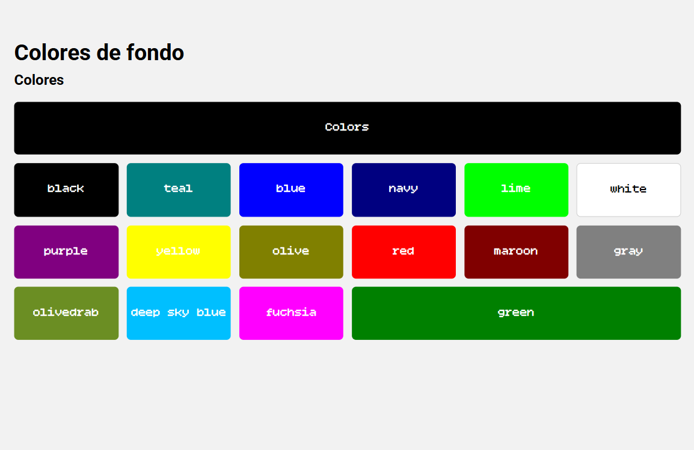
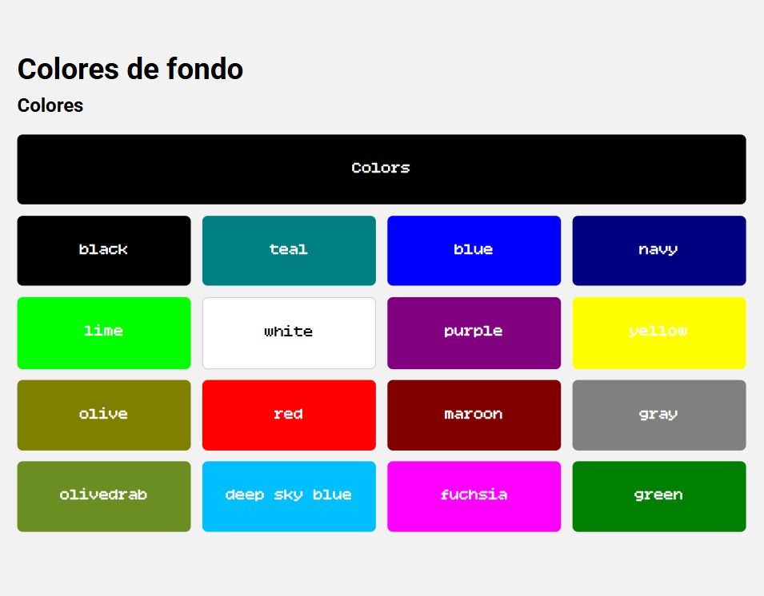
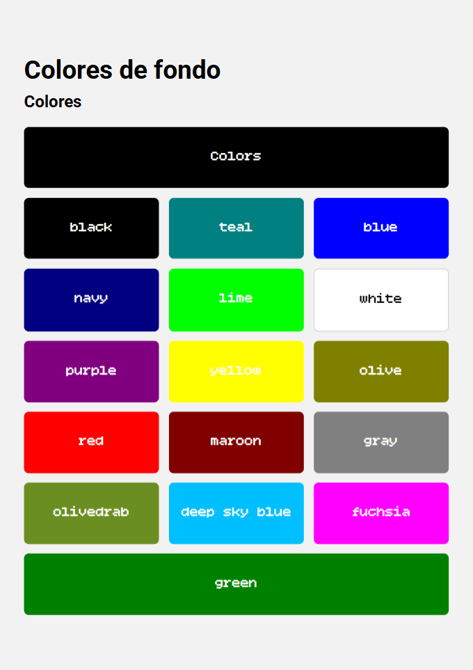

# Exercise - HTML5 & CSS3 - Frontend - Reproduce using Grid

## Objetivo
Reproduce la siguiente imagen utilizando html y css.

## Requisito
- Usar grid.
- Totalmente responsive: Phone, Tablet y Desktop.
- Debes utilizar una fuente de [Google Fonts](https://fonts.google.com/).

  
Desktop

  
  
Tablet

  
  
Phone

  

## Resource
- Font: https://fonts.google.com/specimen/Bitcount+Single?categoryFilters=Feeling:%2FExpressive%2FPlayful&preview.script=Latn
